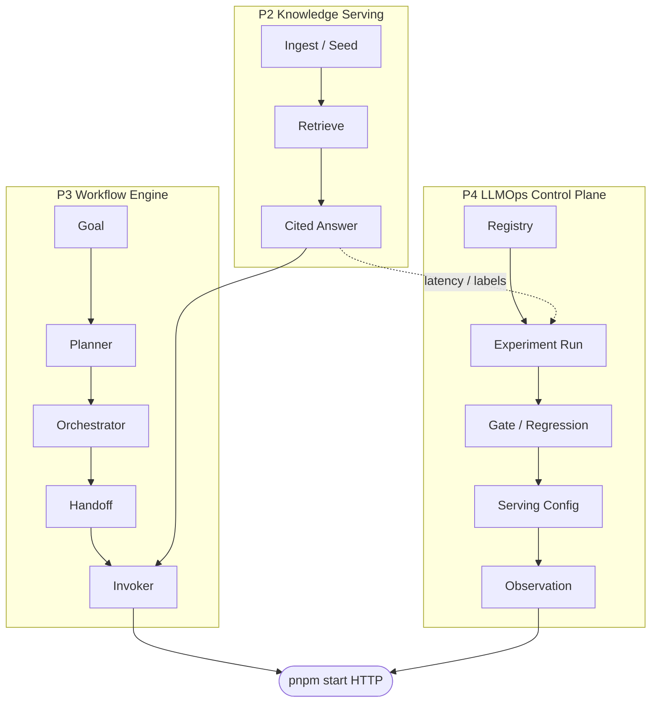

# AI Knowledge Platform

[](https://github.com/ShinSungRok/ai-knowledge-platform/actions/workflows/ci.yml)

**AI Knowledge Platform** is a backend-first, TypeScript platform for
**enterprise knowledge retrieval & serving**, **multi-agent workflow
execution**, and an **LLMOps control plane** — built in public, project by
project, as a portfolio series for AI Backend Engineer roles.

It continues the architecture philosophy of
[Public Law AI](https://github.com/ShinSungRok/public-law-ai) (P1: grounded
legal RAG) and generalizes it into a reusable knowledge → execution →
operations stack. Most portfolio demos stop at “embed, prompt, answer.” This
repository asks what that looks like as a **backend an engineering team could
own**: typed modules, a composition root, Fake-first validation, and a single
runnable HTTP host — not only a notebook or a chat UI.

**Highlights:**

- **3 projects, all CLOSED** — P2 knowledge serving, P3 multi-agent
  workflow engine, P4 LLMOps control plane, each with every charter
  capability at **Completed**, not just scaffolded.
- **180 dependency-free validation scripts + `tsc`** — `pnpm validate`
  proves correctness with zero Docker, network calls, or API keys (8 more
  optional live Postgres/OpenSearch/OTLP/JWT/LLM checks skip with exit 0
  when unconfigured).
- **Real data, not a toy fixture** — 416 real 개인정보보호법 /
  근로기준법 / 정보통신망법 articles from law.go.kr, retrieved with
  hybrid search + LLM-judged reranking (optional real embeddings/LLM via
  env vars, Fake by default).
- **One clone-and-run host** — `pnpm start` serves P2 + P3 + P4 behind a
  single Bearer-guarded HTTP listener, no Express/Fastify.

See [`docs/PORTFOLIO_NARRATIVE.md`](docs/PORTFOLIO_NARRATIVE.md) for Why → What
→ How, [`docs/PROJECT_SYSTEM_REPORT.md`](docs/PROJECT_SYSTEM_REPORT.md) for the
full system assessment (flows / processes / principles), and
[`docs/portfolio.md`](docs/portfolio.md) for charter closeouts and intentional
non-goals.

| Layer | Name | Responsibility |
|---|---|---|
| **P2** | Knowledge Retrieval & Serving | Ingest → retrieve → serve cited answers |
| **P3** | Multi-Agent Workflow Engine | Role-based workflows over that knowledge |
| **P4** | LLMOps / Control Plane | Version, gate, serving config, observe |

```text
P1 Public Law AI          Domain product (grounded legal RAG)
        ↓
P2 Knowledge Retrieval    Knowledge foundation (ingest → serve)
   & Serving Platform
        ↓
P3 Multi-Agent            Workflow execution engine
   Workflow Engine
        ↓
P4 LLMOps                 Operations / control plane
   Control Plane
```

## Release Status

| Project | Status | Notes |
|---|---|---|
| **P2** Knowledge Platform | **CLOSED** | Charter baseline complete; Service Completion track **Complete** (`pnpm start`) |
| **P3** Workflow Engine | **CLOSED** | Five Multi-Agent capabilities all **Completed** |
| **P4** LLMOps Control Plane | **CLOSED** | Five LLMOps capabilities all **Completed** |

Thin HTTP (same host as P2) now covers all ten P3/P4 capabilities, not just
the original write paths — `workflow-runs`, `workflow-agents`,
`llmops/control-plane`, `llmops/experiment-runs/:id`, `llmops/prompts`,
`llmops/models`, `llmops/evaluation-gates`, `llmops/serving-configs`, and
`llmops/observations` (full list under "Completed Scope" below). This is
portfolio evidence layered on top of the charters — it does **not** reopen
charters or invent Project 5.

Default validation stays **dependency-free** (Fake / InMemory — no Docker,
network, or API keys):

```bash
pnpm install
pnpm validate
pnpm typecheck
```

Closeout / evidence scripts (also in `pnpm validate` where applicable):

```bash
pnpm validate:project:final-closeout
pnpm validate:project03:closeout
pnpm validate:project04:closeout
```

## Overview

This repository is not a chatbot wrapper. It is an enterprise-shaped
**AI backend platform**:

- Workspace-scoped knowledge documents, chunks, embeddings, and hybrid retrieval
- Cited grounded answers behind a provider-agnostic `LanguageModelProvider`
- MCP tool surface, single-agent planner/executor/reviewer, jobs, evaluation
- Multi-agent workflow: planner → orchestrator → handoff → invoker → memory
- LLMOps control plane: registries, experiment runs, gates/regression,
  serving configuration, quality/cost/latency observations

Everything important is proven with **`tsx` validation runners** that exit
non-zero on failure — the same discipline as Project 1 — so correctness does
not depend on a live cluster or a paid API key.

## Core Features

- **Cited knowledge serving (P2)** — retrieve evidence, assemble a grounded
  prompt, generate an answer, attach citations; served on
  `POST /workspaces/:id/cited-answers`.
- **Hybrid retrieval with quality gates** — keyword, vector, and hybrid
  search behind ports; per-signal threshold filters reject off-topic
  queries (`insufficientEvidence`), then a normalized reranker plus an
  LLM-judged reranking pass (reusing the same `LanguageModelProvider`, no
  extra dependency) pick the single most relevant chunk among similar
  candidates. Fake/InMemory by default, optional Postgres / OpenSearch
  wiring.
- **Real demo content** — the original MFA/VPN policy excerpt plus a
  law.go.kr snapshot (416 real 개인정보보호법 / 근로기준법 / 정보통신망법
  articles), fetched once via `pnpm demo:seed:law-snapshot` into a committed
  JSON file and served with zero live network calls at runtime.
- **Optional real embeddings** — `EMBEDDING_API_KEY` wires an
  OpenAI-compatible (also Ollama-compatible) embedding provider mirroring
  `LLM_API_KEY`; defaults to Fake char-hash embedding.
- **MCP + agent foundations** — JSON-RPC tools, tool executor, session
  memory, background jobs — Fake-validated, composition-wired.
- **Multi-agent workflow engine (P3)** — researcher / synthesizer / critic
  (and more roles in the contract); researcher can bridge to P2 cited-answer;
  with `LLM_API_KEY`, synthesizer/critic call the same HTTP LLM path.
  Supports conditional step skipping, bounded retry, and dynamic agent
  delegation (see Completed Scope). A separate LLM-as-judge evaluator can
  score a run's content quality, alongside the pure rule-based evaluator.
- **LLMOps control plane (P4)** — InMemory registry → run → gate →
  regression → serving → observation story; thin HTTP plus a live helper that
  measures cited-answer latency into the plane
  (`pnpm demo:llmops:from-cited-answer`).
- **One listening host** — `pnpm start` (`NodeHttpListener`, no Express):
  health, cited-answers, MCP, workflow-runs, llmops/control-plane.

## How It Works

**Knowledge pipeline (P2):**

```text
Source / document → Chunk → Embed → Index
  → Retrieve (keyword / vector / hybrid)
  → Threshold filter (reject off-topic) → Normalized rerank
  → LLM-judged rerank (reuses LanguageModelProvider)
  → Grounding context → Prompt → Language model
  → Grounded answer + citations → HTTP / MCP
```

**Workflow engine (P3):**

```text
Objective → Deterministic planner → Orchestrator
  → Handoff (sequential)
  → Invoker stack: knowledge bridge (researcher) → LLM (synth/critic) → Fake
  → Shared workflow memory → step results
```

**Control plane (P4):**

```text
Prompt / model registry → Experiment run + metrics
  → Evaluation gate → Regression harness
  → Serving configuration → Observation store
```



## Project Goals

- Show a **production-shaped AI backend** (pipelines, engines, control plane),
  not only a prompt wrapper.
- Keep every layer **swappable**: Fake/InMemory today; HTTP LLM, Postgres,
  OpenSearch optional behind the same ports.
- Make correctness **clone-and-run**: `pnpm validate` with zero credentials.
- Ship **incrementally** with explicit Partial vs Completed boundaries —
  Partial evidence is real, but Partial ≠ Completed by design.

## Technology Stack

| Concern | Technology |
|---|---|
| Language | TypeScript (strict) |
| Runtime | Node.js + `tsx` |
| HTTP | Framework-independent router + `NodeHttpListener` (no Express/Fastify) |
| Persistence (optional) | PostgreSQL (`pg`), SQL vector index |
| Search (optional) | OpenSearch HTTP (no official OpenSearch JS SDK) |
| AI (optional) | OpenAI-compatible HTTP chat completions (no vendor SDK) |
| Embeddings (optional) | OpenAI-compatible HTTP embeddings, also Ollama-compatible (no vendor SDK) |
| Tooling | pnpm, Docker Compose scaffolding under `docker/` |

Cross-cutting concerns (retry/timeout, AuthN/AuthZ, logging/metrics/OTLP-lite)
are small in-repo adapters — not a pile of SaaS SDKs.

## Architecture

Clean / Hexagonal / DDD boundaries inherited from Project 1:

- `app/knowledge/domain` has **zero outward dependencies**
- Business logic depends on **ports**, never concrete adapters
- Only `app/knowledge/composition` wires adapters
- Cross-cutting modules may depend downward; production business modules do
  not depend on them

Details: [`docs/architecture.md`](docs/architecture.md),
[`docs/modules.md`](docs/modules.md).

## Module Structure

Application code lives under `app/knowledge/*`:

```
app/knowledge/
  domain/            knowledge document / chunk / source types
  repository/        persistence ports
  persistence/       InMemory + SQL adapters
  pipeline/          sync, chunk, embed, reindex pipelines
  embedding/         chunker, embedding provider, vector index
  retrieval/ search/ vector / keyword / hybrid / rerank
  context/ prompt/   grounding context + prompt builder
  ai/ rag/ citation/ LLM port, answer assembly, citations
  application/       use cases
  api/ http/ server/ controllers, router, Node listener
  mcp/ tools/ agent/ MCP JSON-RPC, tools, single-agent loop
  memory/ jobs/      session memory, job store/handlers
  workflow/          multi-agent planner / orchestrator / handoff / memory
  llmops/            registries, runs, gates, serving, observations
  evaluation/        retrieval / grounding / citation / workflow eval
  observability/     logger, metrics, tracer, OTLP-lite
  reliability/       retry, timeout
  security/          API key / JWT-lite, bearer guard, workspace AuthZ
  composition/       composition root + `pnpm start` host
  config/ infra/     runtime config, SQL gateway helpers
```

## Completed Scope (P2–P4 summary)

### P2 — Knowledge Retrieval & Serving (CLOSED)

Charter platform baseline **Completed** (ingest → retrieve → cited serve,
MCP/agent/jobs/evaluation, ops foundations). Service Completion track
**Complete**: long-running `pnpm start`, optional HTTP LLM / Postgres /
OpenSearch. Partial infra adapters remain Partial.

Manual: [`docs/P2_SERVICE_MANUAL.md`](docs/P2_SERVICE_MANUAL.md).

### P3 — Multi-Agent Workflow Engine (CLOSED)

| Capability | Status |
|---|---|
| Multi-Agent Role Contract | Completed |
| Workflow Orchestrator | Completed |
| Agent Handoff / Delegation | Completed |
| Shared Workflow Memory | Completed |
| Multi-Agent Evaluation | Completed |

Portfolio demos + thin HTTP `POST/GET .../workflow-runs`, `GET .../workflow-runs/:id/memory`,
`GET .../workflow-agents`. Researcher may use P2 cited-answer; synthesizer/critic
may use HTTP LLM when `LLM_API_KEY` is set. Orchestrator supports conditional
step skipping + bounded retry (`workflow.skipRoles` goal metadata) and agent-
initiated dynamic delegation among same-role agents (`delegateToAgentId`).

Manual: [`docs/P3_WORKFLOW_ENGINE.md`](docs/P3_WORKFLOW_ENGINE.md).

### P4 — LLMOps / Control Plane (CLOSED)

| Capability | Status |
|---|---|
| Experiment / Run Tracking | Completed |
| Prompt & Model Registry | Completed |
| Evaluation Gates / Regression Harness | Completed |
| Deployment / Serving Configuration | Completed |
| LLMOps Observability | Completed |

Portfolio demos + thin HTTP `POST/GET .../llmops/control-plane`,
`GET .../llmops/experiment-runs/:id`, `GET .../llmops/prompts`,
`GET .../llmops/models`, `GET .../llmops/evaluation-gates`,
`GET .../llmops/serving-configs`, `GET .../llmops/observations`. Stores
persist for the life of the host process (registered prompts/models/runs/
serving configs/observations accumulate real history). Live metrics
helper records cited-answer wall latency into the plane. Evaluation gate
supports a reusable, request-overridable definition; serving configuration
supports request-driven `environment`/`trafficPercent`.

Manual: [`docs/P4_LLMOPS.md`](docs/P4_LLMOPS.md).

## Validation Strategy

No Jest/Vitest suite for the platform core — each capability ships **validation
runners**: `tsx app/knowledge/**/run*Validation.ts` with hand-rolled asserts,
Fake/InMemory only. `pnpm validate` chains them and ends with `pnpm typecheck`.

Optional live runners (LLM / Postgres / OpenSearch / OTLP) **skip with exit 0**
when env is unset and are **not** required for default validate.

## How to Run

```bash
pnpm install
pnpm validate
pnpm typecheck
```

### Local HTTP host (P2 + P3 + P4 thin APIs)

```bash
cp .env.example .env   # never commit .env — secrets stay local
pnpm start
```

Defaults: `127.0.0.1:8080`, Bearer `demo-key`, workspace `workspace-a`,
InMemory store, Fake LLM, demo knowledge seed.

Optional (see `.env.example`):

| Env | Effect |
|---|---|
| `LLM_API_KEY` (+ `LLM_BASE_URL` / `LLM_MODEL`) | HTTP LLM for cited-answers and workflow synth/critic |
| `EMBEDDING_API_KEY` (+ `EMBEDDING_BASE_URL` / `EMBEDDING_MODEL`) | HTTP embedding provider (defaults to `text-embedding-3-large`, 1536-dim) |
| `DATABASE_URL` | Postgres document store + SQL vectors |
| `OPENSEARCH_URL` | OpenSearch vector index |
| `SKIP_DEMO_SEED=1` | Start without demo seed |

```bash
# health
curl -sS http://127.0.0.1:8080/health

# P2 cited answer (demo seed is an MFA/VPN policy excerpt)
curl -sS -X POST http://127.0.0.1:8080/workspaces/workspace-a/cited-answers \
  -H 'content-type: application/json' \
  -H 'Authorization: Bearer demo-key' \
  -d '{"query":"Is MFA required for VPN?"}'

# P3 workflow run
curl -sS -X POST http://127.0.0.1:8080/workspaces/workspace-a/workflow-runs \
  -H 'content-type: application/json' \
  -H 'Authorization: Bearer demo-key' \
  -d '{"objective":"Is MFA required for VPN?"}'

# P4 control plane (default metrics) 
curl -sS -X POST http://127.0.0.1:8080/workspaces/workspace-a/llmops/control-plane \
  -H 'content-type: application/json' \
  -H 'Authorization: Bearer demo-key' \
  -d '{}'
```

### Console demos (no long-lived server required for Fake paths)

```bash
pnpm demo:workflow:engine
pnpm demo:workflow:p2-bridge
pnpm demo:workflow:evaluation
pnpm demo:llmops:control-plane

# host must be running — measures cited-answer latency into control-plane
pnpm demo:llmops:from-cited-answer

# one-off: fetch law.go.kr articles into the committed snapshot JSON
# (pnpm start reads the snapshot only — never calls law.go.kr live)
pnpm demo:seed:law-snapshot
```

Full env / Docker notes: [`docs/deployment.md`](docs/deployment.md),
[`docs/P2_SERVICE_MANUAL.md`](docs/P2_SERVICE_MANUAL.md).

## Project Structure

```
app/knowledge/     Clean / Hexagonal platform modules
docs/              architecture, modules, manuals, portfolio narrative
scripts/           skeleton / closeout validators
docker/            Dockerfile + compose scaffolding
tests/             inventories / placeholders
.cursor/rules/     persistent agent coding rules
```

## Intentional Non-Goals / Limits

Still deferred by design (see portfolio docs):

- Official OpenTelemetry / OpenSearch / LLM / MCP vendor SDKs
- Express / Fastify as the HTTP stack
- Full OIDC authorization-code login
- Live OTLP export / `@opentelemetry/*`
- LLM-as-judge evaluation *gates* specifically (P4's gates stay numeric
  `gte`/`lte`/`eq` rules; P3's separate workflow-content evaluator does use
  an LLM judge — see Core Features)
- Inventing Project 5

Live LLM and infra are **optional** paths for demos; Fake validation remains
the default proof.

## Portfolio Highlights

Interview narrative and talking points:
[`docs/PORTFOLIO_NARRATIVE.md`](docs/PORTFOLIO_NARRATIVE.md).

**One-liners:**

- **P2** — “I built a knowledge retrieval and serving platform: ingest to
  cited answers, Fake-validated, with a runnable HTTP host.”
- **P3** — “I added a multi-agent workflow engine — plan, handoff, memory —
  so complex work runs as backend workflows, not a single prompt.”
- **P4** — “I added an LLMOps control plane: registries, gates, serving
  config, and observations — so the system can be operated, not only demoed.”
