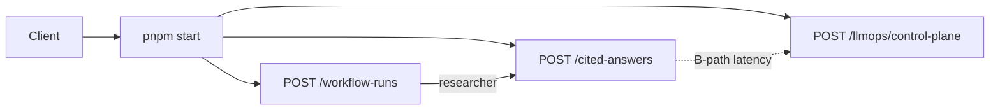

# AI Knowledge Platform — 시스템 총평 보고

> 산출물: 프로젝트 전체 총평 · 논리 흐름 · 프로세스 · 설계 원리  
> 대상: P2 Knowledge Serving · P3 Workflow Engine · P4 LLMOps Control Plane  
> 일자: 2026-07-24 (2026-07-30 갱신: P2 리트리벌 품질 개선 반영 — §11)  
> 저장소: https://github.com/ShinSungRok/ai-knowledge-platform

관련 문서: [`README.md`](../README.md) ·
[`PORTFOLIO_NARRATIVE.md`](PORTFOLIO_NARRATIVE.md) ·
[`architecture.md`](architecture.md) ·
[`P2_SERVICE_MANUAL.md`](P2_SERVICE_MANUAL.md) ·
[`P3_WORKFLOW_ENGINE.md`](P3_WORKFLOW_ENGINE.md) ·
[`P4_LLMOPS.md`](P4_LLMOPS.md)

---

## 1. 총평 (Executive Summary)

**결론:** 포트폴리오용 **AI Backend 플랫폼 시리즈의 큰 틀은 마무리**되었다.
Knowledge(기반) → Workflow(실행) → LLMOps(운영) 스토리와, 동일 호스트에서
돌릴 수 있는 HTTP 증거가 갖춰져 있다.

이것은 **엔터프라이즈 완제품 출시**를 의미하지 않는다. P3/P4는 헌장상
**CLOSED (Partial)** 이며 Partial ≠ Completed다. 기본 증명은 Fake/InMemory
검증이고, 실 LLM·실측 latency는 **선택적 데모 경로**다.

| 관점 | 평가 |
|---|---|
| 포트폴리오 스토리 완성도 | 높음 — P1→P2→P3→P4 진화가 설명 가능 |
| 아키텍처 일관성 | 높음 — Clean/Hexagonal/DDD, composition root |
| 검증 가능 증명 | 높음 — `pnpm validate` 무의존 |
| 프로덕션 운영 성숙도 | 제한 — Partial 경계, Fake 임베딩, InMemory ops |
| 면접 설득력 | 충분 — Why/What/How + 실 curl 데모 |

**한 줄:**  
“완제품이 아니라, **팀이 소유할 수 있는 형태의 AI 백엔드 플랫폼 골격**을
Fake-증명하고, 실 LLM까지 같은 호스트에서 시연할 수 있게 만든 프로젝트.”

---

## 2. 논리 구조 (Logic Architecture)

### 2.1 시리즈 위치

```text
P1 Public Law AI          도메인 제품 (법률 Grounded RAG)
        ↓
P2 Knowledge Serving      지식 기반 (ingest → serve)
        ↓
P3 Workflow Engine        실행 엔진 (역할 협업)
        ↓
P4 LLMOps Control Plane   운영 평면 (버전·게이트·관측)
```

### 2.2 런타임 계층

```text
                    +---------------------------+
                    |  P4 LLMOps Control Plane  |
                    |  Registry · Gate · Serving|
                    |  Observation (soft-link)  |
                    +------------▲--------------+
                                 │ metrics / labels
             +-------------------+-------------------+
             │                                       │
             ▼                                       ▼
 +------------------------+           +------------------------+
 | P2 Knowledge Serving   |◄──────────| P3 Workflow Engine     |
 | Retrieve → Cite → LLM  |  reuse    | Plan → Handoff → Invoke|
 +-----------▲------------+           +-----------▲------------+
             │                                    │
             +----------------┬-------------------+
                              │
                              ▼
                 Client (curl / future UI)
                 pnpm start · NodeHttpListener
                 Bearer + Workspace AuthZ
```

### 2.3 요청 경로 (동일 호스트)



| Endpoint | Plane | 인증 |
|---|---|---|
| `GET /health` | ops | 공개 |
| `POST /workspaces/:id/cited-answers` | P2 | Bearer |
| `POST /workspaces/:id/workflow-runs` | P3 | Bearer |
| `POST /workspaces/:id/llmops/control-plane` | P4 | Bearer |
| `POST /mcp` | P2 MCP | Bearer |

---

## 3. 프로세스 (Process Flows)

### 3.1 P2 — Cited Knowledge Serving

**목적:** 워크스페이스 지식을 근거로 인용 가능한 답을 서빙한다.

```text
[Seed/Ingest]
  Document → Chunk → Embed → VectorIndex
    (demo MFA/VPN 청크 + law.go.kr 실 조문 416개 스냅샷, additive)
        ↓
[Request] query
        ↓
Retrieve (keyword / vector / hybrid)
        ↓
Threshold filter (벡터/키워드 각각 — 무관 후보 제거)
        ↓
Normalized rerank → 최소 관련도 미만 제거
        ↓
LLM-judged rerank (같은 LanguageModelProvider가 후보 전체 0~10점 채점)
  → 임계값 미만 전부 제거 시 insufficientEvidence
        ↓
Assemble GroundingContext → Build GroundedPrompt
        ↓
LanguageModelProvider.generate
  (Fake 기본 | HTTP LLM when LLM_API_KEY)
        ↓
Assemble GroundedAnswer → Build Citations
        ↓
HTTP 200 CitedGroundedAnswer
```

**핵심 원리**

- 답은 모델 기억만이 아니라 **검색된 청크**에 grounded 되어야 한다.
- LLM은 `LanguageModelProvider` 포트 뒤 — Fake와 HTTP가 동일 use case를 탄다.
- 임베딩 기본은 Fake(문자 해시); `EMBEDDING_API_KEY` 설정 시 OpenAI 호환
  실 임베딩(1536차원, 기본 `text-embedding-3-large`) 사용 가능.
- 검색은 임계값 필터 + LLM 판정 재랭킹까지 거쳐야 근거로 인정된다 — 벡터
  유사도 하나만으로는 무관 질의 차단도, 유사 후보 중 정답 선별도 불충분
  (§11 참고).

### 3.2 P3 — Multi-Agent Workflow

**목적:** 목표를 역할 단위 스텝으로 나누어 실행한다.

```text
objective
  → DeterministicWorkflowPlanner
      (registered roles: researcher → synthesizer → critic)
  → DefaultWorkflowOrchestrator
      → Handoff (이전 step output → 다음 input)
      → Invoker stack (outer → inner):
          KnowledgeAnswerWorkflowAgentInvoker  (researcher → P2)
          LanguageModelWorkflowAgentInvoker    (synth/critic → LLM)
          FakeWorkflowAgentInvoker             (fallback echo)
      → InMemoryWorkflowMemoryStore (append-only)
  → WorkflowRunResult (stepResults[])
```

| Role | 책임 | 이 호스트에서의 구현 |
|---|---|---|
| researcher | 근거 수집 | P2 cited-answer bridge |
| synthesizer | 초안·요약 | HTTP LLM (키 있을 때) |
| critic | 리스크·공백 검토 | HTTP LLM (키 있을 때) |

**핵심 원리**

- Agent는 **정체성(role)** 이고, 실행은 **Invoker**가 한다.
- P3는 “어떤 벤더 LLM이 나은가”가 아니라 **워크플로 실행 계층**.
- critic은 지식을 재검색하지 않고 **이전 스텝 텍스트**만 비평할 수 있다.

### 3.3 P4 — LLMOps Control Plane

**목적:** 실행 위에 버전·평가·서빙설정·관측 스토리를 둔다.

```text
PromptRegistry + ModelRegistry
  → ExperimentRunStore (params soft-link + metrics)
  → EvaluationGateEvaluator (numeric rules)
  → RegressionHarness (baseline vs candidate)
  → ServingConfigStore (activate)
  → LlmopsObservationStore (quality / cost / latency)
```

**B-path (실측 헬퍼)**

```text
POST cited-answers  →  wall latencyMs (+ soft quality proxy)
        ↓
POST llmops/control-plane  { metrics, servingLabels from LLM_MODEL }
```

**핵심 원리**

- Control plane은 **실행기를 대체하지 않는다**. soft-link id와 메트릭만 다룬다.
- 기본 `{}`는 데모 통과 메트릭; B-path의 **latency는 벽시계 실측**.
- hitRate/MRR는 grounded 여부의 soft proxy — 풀 평가 스위트가 아님.

---

## 4. 설계 원리 (Principles)

| # | 원리 | 실천 |
|---|---|---|
| 1 | **Ports before adapters** | domain/application은 인터페이스만; composition만 배선 |
| 2 | **Fake-first validation** | `pnpm validate` = Docker/키/네트워크 불필요 |
| 3 | **Partial ≠ Completed** | 경계 증거를 Completed로 과장하지 않음 |
| 4 | **One composition root** | `app/knowledge/composition`만 구체 타입 import |
| 5 | **Reuse downward** | P3→P2 지식, P4→실행 메타; 상위가 하위를 대체하지 않음 |
| 6 | **No Express/Fastify** | `NodeHttpListener` + 자체 router |
| 7 | **Secrets out of git** | `.env` gitignore; 원격에 API 키 없음 |
| 8 | **No Project 5 by default** | 헌장 없이 범위 확장하지 않음 |

의존성 방향 (요약):

```text
domain (0 outward)
  ↑ repository / persistence / embedding / search / retrieval
  ↑ context / prompt / ai / rag / citation
  ↑ application
  ↑ api / http / server
  ↑ composition  ← only place that wires adapters
```

---

## 5. 상태 매트릭스

| Track | Status | 의미 |
|---|---|---|
| P2 Charter baseline | CLOSED | 플랫폼 골격 Completed |
| P2 Service Completion | Complete | `pnpm start` 등 인간 승인 트랙 |
| P3 Multi-Agent (5 caps) | CLOSED (Partial) each | Fake 경계 증명; Completed 아님 |
| P3 Thin Workflow HTTP | Complete | Bearer `workflow-runs` |
| P4 LLMOps (5 caps) | CLOSED (Partial) each | InMemory 스토리; Completed 아님 |
| P4 Thin Control Plane HTTP | Complete | Bearer `control-plane` |
| Live LLM / live metrics | Demo path | 선택 env; 기본 validate와 분리 |

---

## 6. 실측 데모에서 확인된 사실 (2026-07)

| 시나리오 | 관측 | 해석 |
|---|---|---|
| P2 + Gemini + MFA 시드 | 200, evidence/citation | 실지식+실 LLM grounded serve |
| P3 workflow | researcher=`knowledge:…`, synth/critic 자연어 | Fake echo 제거, 역할 LLM 동작 |
| P4 `from-cited-answer` | `latencyMs≈3513`, `modelName=gemini-…` | 서빙 실측이 ops에 기록됨 |
| P2 리트리벌 정밀도 (2026-07-30) | 완전 무관 질의 → 100% `insufficientEvidence`; 어휘 중복만 있는 오답, 다의어(사용자=고용주/계정) 오답도 차단; 유사 후보 다수 중에서도 정답 조문이 항상 1위 | 임계값 필터(벡터/키워드) + 정규화 재랭킹 + LLM 판정 재랭킹 조합으로, 벡터 유사도 단독으로는 못 넘던 정밀도 한계 해결 |

한계를 같이 말할 것:

- 임베딩은 기본 Fake; `EMBEDDING_API_KEY` 설정 시 실 임베딩(선택 경로)
- P4 품질 메트릭은 soft proxy
- P4 저장은 요청 단위 InMemory (영속 대시보드 아님)

---

## 7. 강점과 한계

### 강점

1. **백엔드 중심 서술** — UI/벤더 자랑보다 파이프라인·엔진·컨트롤 플레인
2. **검증 철학** — 클론 후 키 없이 `pnpm validate`
3. **경계의 정직함** — Partial을 Completed로 포장하지 않음
4. **통합 데모** — 한 프로세스에서 3 plane HTTP

### 한계 / 비목표 (의도적)

1. 제품형 프론트엔드 없음  
2. 문서 업로드/커넥터 운영 HTTP 제품화 미완 (law.go.kr는 1회성 스냅샷 스크립트이지 상시 커넥터 아님)  
3. 영속 LLMOps·공식 OTLP SDK 미채택 (실 임베딩은 2026-07-30부로 선택 경로 채택 — §11)  
4. P3/P4 charter Completed 승격 없음  

---

## 8. 면접용 압축 스크립트

**Why:** 기업 지식을 서빙하고, 복잡한 일을 워크플로로 돌리며, 그걸 버전·게이트·
관측으로 운영할 백엔드가 필요했다.

**What:** TypeScript Clean Architecture 플랫폼 — P2 serving, P3 workflow, P4
control plane — 동일 `pnpm start` 호스트.

**How:** Ports/adapters + Fake validators; researcher→P2; synth/critic→HTTP LLM;
control plane에 cited-answer latency 주입 헬퍼.

**Honest limit:** Partial ≠ Completed; Fake embedding; InMemory ops by default.

---

## 9. 산출물 목록

| 산출물 | 위치 |
|---|---|
| 본 시스템 보고 | `docs/PROJECT_SYSTEM_REPORT.md` |
| README (P2–P4 요약) | `README.md` |
| Why/What/How 내러티브 | `docs/PORTFOLIO_NARRATIVE.md` |
| 아키텍처 | `docs/architecture.md` |
| P2/P3/P4 매뉴얼 | `docs/P2_*.md`, `P3_*.md`, `P4_*.md` |
| 코드 증거 | `app/knowledge/{workflow,llmops,composition,api}` |
| 원격 | https://github.com/ShinSungRok/ai-knowledge-platform |

---

## 10. 권고 (다음이 있다면)

큰 틀을 건드리지 않는 선에서만:

1. 포트폴리오 **스크린샷/터미널 캡처**를 README에 보강  
2. ~~실 임베딩~~ (2026-07-30 완료 — §11); 문서 import API(상시 커넥터)는
   여전히 **별도 인간 승인 스코프**  
3. Partial→Completed 승격은 **새 헌장 없이 하지 말 것**

---

## 11. 2026-07-30 업데이트 — P2 리트리벌 품질 개선

**배경:** Fake 임베딩/벡터 유사도만으로는 (a) 완전히 무관한 질의도 항상
그럴듯한 근거를 찾아 답변해버리는 문제, (b) 여러 후보가 topically 유사할
때 진짜 정답 조문을 안정적으로 1위로 못 올리는 문제가 있었음이 라이브
검증(실 OpenAI 키)으로 확인됨.

**변경 사항 (기존 "Complete" 클래스는 무수정, 신규 데코레이터만 composition
root에서 추가 배선):**

1. **실 데이터 추가** — `LawGoKrKnowledgeSourceConnector`가 law.go.kr
   (`OC=test`, 무등록) 조문을 파싱; `pnpm demo:seed:law-snapshot`으로 1회
   fetch해 커밋된 스냅샷(개인정보보호법/근로기준법/정보통신망법 총 416개
   조문)으로 저장. `pnpm start`는 이 스냅샷만 읽고 런타임에 law.go.kr을
   호출하지 않음. 기존 MFA/VPN 데모 문서에 **추가(additive)**.
2. **실 임베딩(선택)** — `HttpEmbeddingProvider`(OpenAI 호환, Ollama 호환)를
   `EMBEDDING_API_KEY`로 활성화, 1536차원(`text-embedding-3-large` 기본).
   기본값은 여전히 Fake.
3. **임계값 필터** — `ThresholdFilteringVectorRetriever`(코사인 유사도 ≥
   0.35), `ThresholdFilteringKeywordSearch`(커버리지 ≥ 0.3) — 무관 후보를
   조기에 제거.
4. **정규화 재랭킹** — `NormalizedReranker`가 RRF 점수(최대 ~0.033)와
   키워드 점수(0~1) 스케일 불일치를 보정.
5. **LLM 판정 재랭킹** — `LlmRerankedSearch`가 생존 후보 전체 + query를
   기존 `LanguageModelProvider`(신규 외부 의존성 없음) 한 번의 프롬프트로
   보내 0~10점 관련도를 매기고 재정렬; 임계값(0.4) 미만은 모두 제거.
6. **루트 코즈 버그 수정** — 시딩 함수가 composition에 설정된 실 임베딩과
   무관하게 문서를 `FakeEmbeddingProvider`로 하드코딩 임베딩하고 있어,
   query는 실 임베딩·문서는 Fake 임베딩으로 서로 다른 벡터 공간을 비교하던
   버그를 발견해 수정.

**검증:** `pnpm validate`(exit code 명시적으로 확인 — 파이프 종료코드
착시 주의) + 라이브 curl로 재현: 완전 무관 질의·다의어 오답·어휘 중복
오답 전부 차단 확인, 여러 재작성 질의에서도 정답 조문이 실제 본문과
대조해 매번 1위임을 확인.

**커밋:** `6fceed1`, `origin/main` 푸시 완료.

**보고 종료.**
